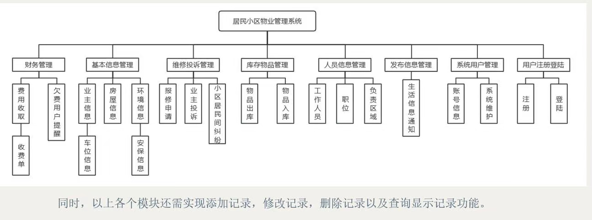
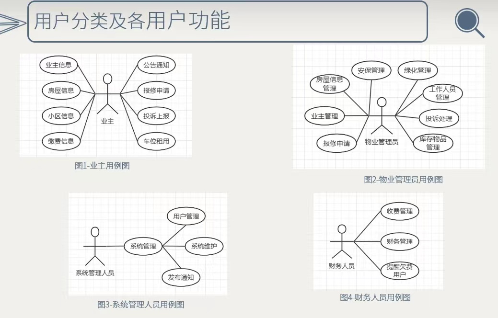
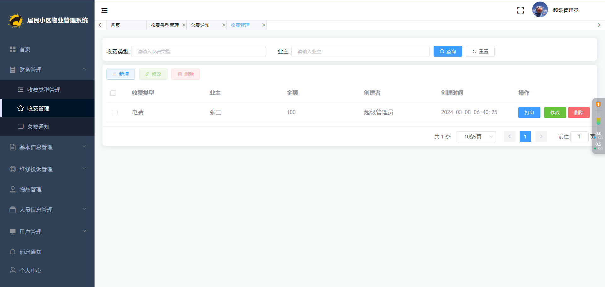
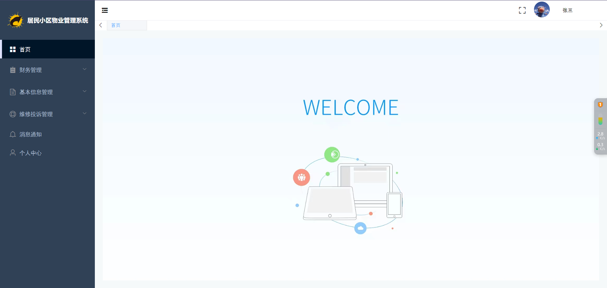
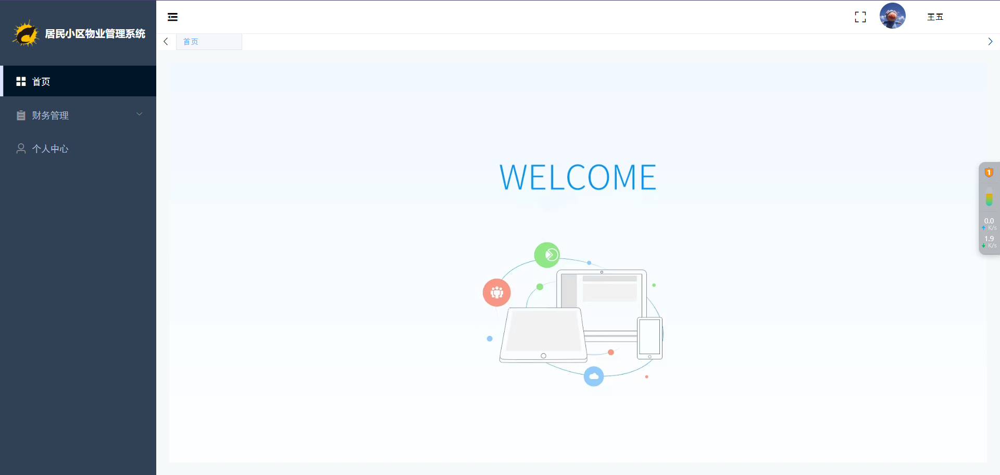
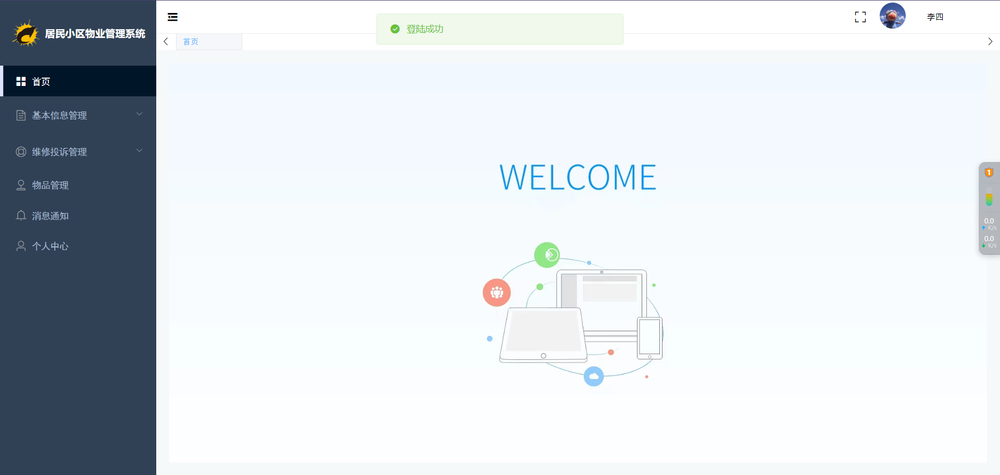

# 基于SpringBoot+Vue的小区居民物业管理系统的设计与实现

**有问题或获取源码可以咨询企鹅Q1760272627** 

### 功能：
业主功能：业主信息，房屋信息，小区信息，缴费信息，公告通知，报修申请，投诉上报，车位租用
物业管理员功能：报修申请，业主管理，房屋信息管理，安保管理，绿化管理，投诉管理，库存物品管理
财务人员功能：收费管理，财务管理，欠费管理
系统管理员：用户管理，通知管理，以上角色所有功能

### 采用技术：
SpringBoot，shiro，Mybatis-plus，Vue，redis，mysql，ElementUi，echarts

### 工具：
idea，vscode，navicat

### 功能结构：

### 系统截图：

**有问题或获取源码可以咨询企鹅Q1760272627** 
